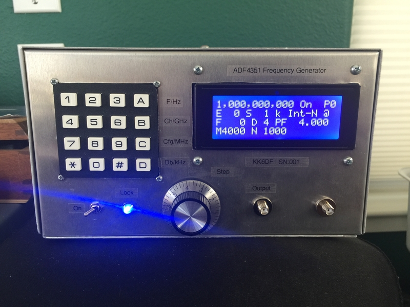
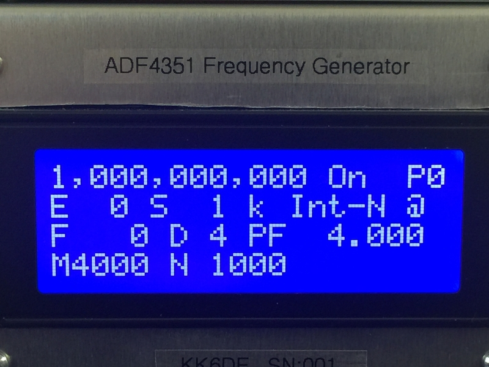

# siggen4351
*Signal Generator using ADF4351 and Arduino*

## Introduction
This project is a wideband signal generator for frequencies from 35 MHz to 4.4 GHz. It was designed to be used as a bench or RF laboratory test equipment to provide a very wideband, and stable, and user controllable frequency reference source, suitible for use in RF circuit and testing activities.  However, the techniques and circuits used can be adapted for other uses, including a VHF/UHF/microwave VFO or Local Oscillator for ham radio projects, or (with modified software) as a sweep generator or other test equipment. 

The heart of the project is the [SV1AFN ADF4351 PLL Synthesizer Module](https://www.sv1afn.com/adf4351m.html), a low cost PCB module built and designed by Makis Katsouris, SV1AFN. This board uses the Analog Devices ADF4351 Wideband PLL Frequency Synthesizer, which enables a very wide bandwidth (35 MHz - 4.4 GHz) output frequency using a programmable Fractional-N and Integer-N Phase-Locked Loop (PLL) and Voltage Controlled Oscillator (VCO) with an external loop filter and frequency reference. The SV1AFN module provides the loop filter and other components to make it easy to integrate the ADF into a new design.  The SV1AFN module provides an SPI interface for setup and control of the ADF4351 chip, which is used by Arduino Nano to provide overall control and I/O for the signal generator.  

The signal generator provides an LCD display that shows the current frequency and PLL status, and uses both a 16 key matrix keypad and a high resolution absolute encoder (ACE128) to receive the user input. These were used to provide mutliple methods to quickly set and change the current frequency. 

The generated output (a sine wave) can be adjusted to one of four output levels, and is sent to an SMA output port.  The project also provides for both an internal frequency reference sources (typically a Ovenized Crystal Oscillator (OCXO) in the range from 10MHz to 250MHz),
and provides an SMA input port for using an external frequency reference.  The project provides automatic switching between the internal and external frequency references, which was testing with a GPS Disiplined Oscillator (GPSDO) 10 MHz reference.    

An Arduino Nano is used to control the ADF, and manage the I/O with the user, as well as provide a USB interface for controlling the frequency source. 

## Features

+ Frequency Range: 35 MHz to 4.4 GHz
+ Output Level: -4 dBm to 5 dBm (in 3 dB steps) 
+ In-Band Phase Noise: -100 dBc/Hz (3 kHz from 2.1 Ghz carrier)
+ PLL Modes: Fraction-N and Integer-N (set automatically)
+ Step Frequency: 1 kHz to 100 MHz  
+ 16 key Matrix Keypad Input and Control
+ Rotary Encoder for frequency stepping
+ Signal On/Off control
+ USB Interface for frequency setting and readout
+ LCD Display (frequency, PLL and Mode variables)
+ Timer for OCXO temperature stablization
+ Automated Switching for Internal/External Reference Source
+ Internal 100MHz frequency reference source
+ Software for supporting 25 MHz and 10 MHz ref frequencies.
+ Uses 12 volt DC 1.5A power supply

## Hardware

### ADF4351 Frequency Synthesizer

The [SV1AFN ADF4351 Board](https://www.sv1afn.com/adf4351m.html), available from SV1AFN's website.  The  [ADF4351](https://goo.gl/tkMjw6) documentation is provided by Analog Devices through their website. 

### Reference Frequency

A Wenzel 100 MHz OCXO is used to provide an internal reference. This can be easily changed to another reference frequency, as long as a low phase noise, stable reference source is used.  This OCXO was used as it was an excellent reference source with 12v power requirements, and provided an SMA interface for output. A TL431 voltage reference circuit was used to provide a stable voltage control reference for the OCXO voltage control inteface. 

### Schematics

+ [Circuit Schematic](hardware/adf4351-v5-sch.pdf)
Wiring for Arduino/SV1AFN modules, and the ref auto switching circuit. 

### Arduino Nano

An Arduino Nano is used for the microcontroller board.  This board has a small footprint, and low power consumption, and provides the USB interface.

### I/O

#### LCD Display
A basic 20x4 LCD display, with a PCF8574 interface (I2C). It uses the LiquidCrystal\_PCF8574 arduino library (included), which has a smaller size and appears to be faster than the standard LCD libraries.

####  Matrix Keypad
A 16 key Matrix keypad, using a PCF8574 module to detect and decode key presses, plus reduces the Arduino interface to 2 wires (I2C). The PCF8574 module was one designed for interfacing with LCDs, but it was modified to remove the transistor switch and resistor on pin 8 (normally used by LCDs), to restore pin 8 a regular digital pin.  This was done, as the keypad requires 8 digital pins from the PCF module (4x4 matrix). 

The OneWireKey arduino library (included) provides the software API to detect key press, and distingish short, medium and long press times from the keypad.  

The keypad is used for frequency settings, configuration and control settings. For this application, using a true keypad with nice tactile feedback allows for rapid entry of frequency and other settings.  

#### High Precision Absolute Encoder (ACE128)
A great Tindie project created by [RedHunter](https://www.tindie.com/products/arielnh56/high-resolution-absolute-encoder-128-positions/) provides a precision rotary encoder for the Arduino. The encoder is used for stepping frequency, which provides for a useful alterative to the keypad entry.  The ACE128 provides an Arduino library on their website.

## Software
The Arduino software and specialized libaries are provided in the repository.  An ADF4351 interface API is provided, which can be used as a stand-alone library for other projects. 

 In order to accurately perform the necessary double long (64 bit) integer math operations for the PLL and frequency generation,  which is not provided by the native Arduino libraries, the fantastic  `BigNumber` Arduino library by Nick Gammon was used.  This library was modified in order to provide unsigned long integer interfaces, so use the one provided in the repository, rather than the one from Nick.  

Other libaries include an EEPROM extension for reading and writing settings to the EEPROM (for maintaining settings between reboots), and the I/O libraries for the LCD, encoder and keypad. 

### Installation
Copy the `src/` directory to your Arduino sketchbook directory (named the directory `siggen4351`), and install the libraries in your Arduino library directory. 

## References

+ [ADF4351 Product Page](https://goo.gl/tkMjw6) Analog Devices
+ [SV1AFN ADF4351 Board](https://www.sv1afn.com/adf4351m.html) by Makis Katsouris, SV1AFN
+ [High Resolution Absolute Encoder ACE128](https://www.tindie.com/products/arielnh56/high-resolution-absolute-encoder-128-positions/) by RedHunter on Tindie
+ [Big Number Arduino Library](https://github.com/nickgammon/BigNumber) by Nick Gammon
+ [LiquidCrystal_PCF8574](https://github.com/mathertel/LiquidCrystal_PCF8574) by Matthias Hertel

## Pics

